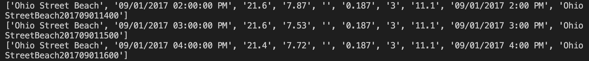
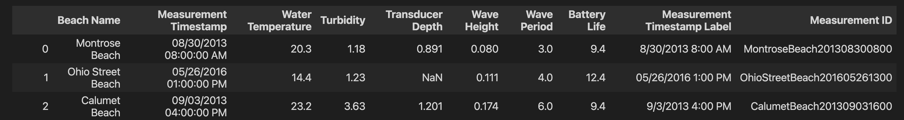

# How To Read A CSV File In Python

## What Is A CSV File

I first began to work with CSV files when taking the backend portion of my software engineering bootcamp curriculum. It wasn't until I began to dive more into the data science portion of my continued learning that I began to use them on a regular basis.
 
CSV stands for comma-separated values, and files containing the `.csv` extension contain a collection of comma-separated values used to store data.
 
In this tutorial we will be using the public `Beach Water Quality` data set stored in the `bwq.csv` file. You can obtain the file by downloading it from [Kaggle](https://www.kaggle.com/sveneschlbeck/chicago-beach-water-quality?select=bwq.csv), however, you should be able to read any csv file following the instructions below.


## Read A CSV File Using Python

There are two common ways to read a `.csv` file when using Python. The first by using the `csv` library, and the second by using the `pandas` library.

### 1. Using The CSV Library

```python

import csv

with open("./bwq.csv", 'r') as file:
  csvreader = csv.reader(file)
  for row in csvreader:
    print(row)

```

Here we are importing the `csv` library in order to use the `.reader()` method it contains to help us read the `csv` file.
 
The `with` keyword allows us to both open and close the file without having to explicitly close it.
 
The `open()` method takes two arguments of type `string`. First the file name, and second a mode argument. Here we are using `r` for read, however this can be omitted as `r` is assumed by default.
 
We then iterate over all the rows.

You should expect an output in the terminal to look something like this:




### 2. Using The Pandas Library


```python
import pandas as pd
data = pd.read_csv("bwq.csv")
data
```

Here we're importing Pandas, a Python library used to conduct data manipulation and analysis. It contains the `.read_csv()` method we need in order to read our `csv` file.
 
You should expect the output to look something like this:




## Possible Delimiters Issues

The majority of `csv` files are separated by commas, however, there are some that are separated by other characters, like colons for example, which can output strange results in Python.

### Solutioning For Delimiters Using The CSV Library
 
To solution for delimiter issues using the `csv` library, simply pass in the `delimiter= ':'` argument in the `reader()` method like so:


```python

import csv

with open("./fileWithColonDelimeter.csv", 'r') as file:
  csvreader = csv.reader(file, delimiter=':')
  for row in csvreader:
    print(row)

```

For other edge cases in reading `csv` files using the `csv` library, check out [this page](https://docs.python.org/3/library/csv.html) in the Python docs.


### Solutioning For Delimiters Using The Pandas Library

To solution for delimiter issues using the `pandas` library, simply pass in the argument `delimiter= ':'` in the `read_csv()` method like so:

```python

import pandas as pd
data = pd.read_csv("fileWithColonDelimeter.csv", delimiter= ':')
data

```

 For other edge cases in reading `csv` files using the Pandas library check out[this page](https://pandas.pydata.org/docs/reference/api/pandas.read_csv.html) the Pandas docs.

## Up Next

For a more in depth tutorial on what you can do after reading a `csv` file, check out [Plotting Precipitation with Python, Pandas and Matplotlib](https://earthly.dev/blog/plotting-rainfall-data-with-python-and-matplotlib/) by Alex Couture-Beil.

---
***While you’re here:***
 
[Earthly](https://earthly.dev/) is a syntax for defining your build. It works with your existing build system. Get repeatable and understandable builds today.
---

